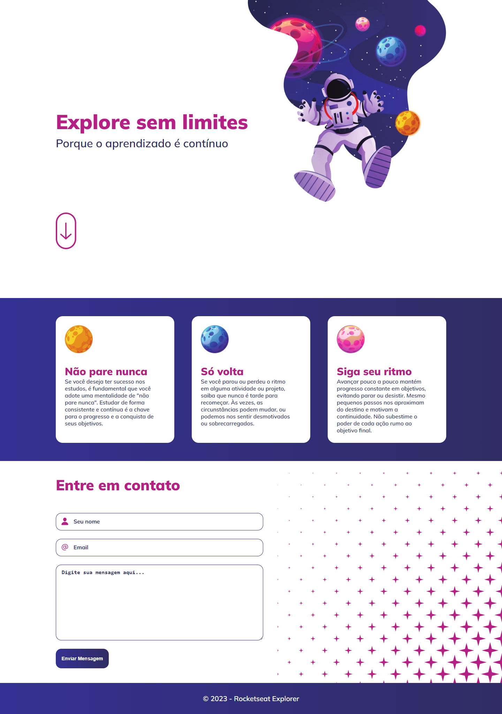

## 💻 Desafio - Explore sem limites
Esse projeto foi um desafio de recriar uma aplicação, a partir de um layout pronto no Figma.
 

  

## 🚀 Tecnologias

Esse projeto foi desenvolvido com as seguintes tecnologias:

- HTML
- CSS
- Git e Github

---

[Clique aqui para acessar](https://pedro-k.github.io/explore_sem_limites/)

---
## 💻 Contato
pedro.kleinfelder@hotmail.com